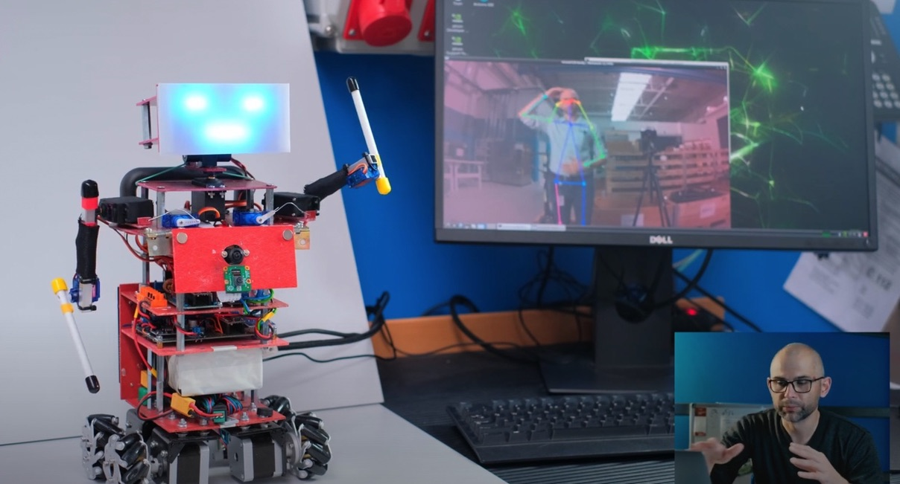

# Jetson Nano Control for Mariola Robot

## Introduction
This repository contain the python based code build to be used on the NVidia Jetson Nano 2GB unit as a "brain" to control the Mariola robot.

Mariola ( [Mariola's repo](https://github.com/tymancjo/Mariola) ) is a home made robot unit build up to experiment nad learn about the basic robotic mechanics, behavior and to experiment with human-robot interactions. 

The robot developed along as every next step brought the new ideas and challenges. However as cool as the mechanics itself became - mine idea of robot is to make it behave at least in some way autonomic. 

## Jetson nano and ML 
The basic experiments were made on the rPI4 using TensorFlow. This solution was finally apply in the Mariola brother robot Dzordz. 
But the potential power of the pre trained model available for the Jetson along with the nano model affordability brought me to use the 2GB version - to learn and see how it works. 

### The idea
The initial concept was about 2 step approach:

- recreate the TensorFLow model - that was following people (moving head, turning, moving) 
- make Mariola repeat hands movement of the observed person.

This repo implementation realize the later. 

## How it works?

The first part is to use the Jetson with the rPI camera v2.1 equipped in 160deg lens to get the image. 
The image is then used as an input tuo the pose recognition network model __resnet18-body__.

Model output is analyzed and base on the number of detected poses - appropriate decisions are made:

- if no pose visible - go to search mode (look around)
- if more then 1 pose detected - just the head follows the people
- if single pose is detected - the robot head and body follows the person (turning to it) and the robot try's to mimic hand movement. 

If poses data are available - particular points (joints) coordinates are gathered (elbows, arm joint, hands) and position of those in _relative space_ (in relation to the size of the person in frame) is calculated. 

Having this coordinates, the inverse kinematic model fot the hands is used to determine each robot hand joints angles. 

Those angles are sent via serial (UART) connection to the master Arduino Nano unit in the robot - and later on are translated to commands for particular Mariolas subsystems like - wheels, arms, head, face using CAN Bus communication. 

The rest is done by particular subsystem control uC (each one have it own Arduino Nano). 

## Demo
General overview talk is in the video:
[Mariola Overview](https://youtu.be/n5zZ9u3IKxk)

You can find some videos of the each iteration of the work over this Jetson implementation in my YT playlist:
[With Jetson Nano](https://youtube.com/playlist?list=PL9g9iwA2sCQyGAkyknFpO8RpEV-7sKZf-)
The videos are mainly in Polish for the moment. 

# This is a living project...

